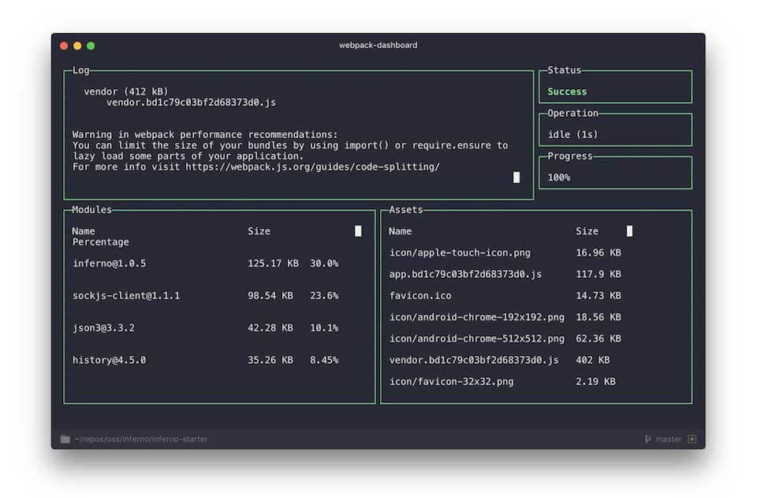

# inferno-starter

> Want to learn infernojs or kickstart your next application!  🔥(SPA / SSR / PWA / Webpack, etc) ? <br /> Checkout the branches below:
- `master` - aim to make it ideal SSR with webpack2 [merger of all other branches]
- `ssr` - aim to have SSR converted from SPA. Will be removed once ssr is merged to master [WIP]
- `spa` - aim to have SPA with merger of all possible feature branches [TBD, for now check master until `ssr` branch is completed]
- `redux` - adds inferno-redux with component in SPA. Additionally added redux-thunk to show middleware usage. [feature branch]
- `lazyload` - adds code-splitting for lazy loading js components at route level in SPA. (plans to extend to css later) [feature branch]

**Check the commits of feature branches to see how the feature is added step by step.**

<br />

> :triangular_flag_on_post: **Contribute:** Inferno js has pretty less learning resources. With repos like this and others, it can provide a great learning resource or a ready-to-use boilerplate for the community. You'are very much welcome to contribute **features/enhancements** following the best practices. Please keep following things in mind before sending PRs.


> :triangular_flag_on_post: **Back Links:** Who doesn't want learning resources to be at one place. If you're using this repository, it would be great to send a PR (README.md) adding your repo link below:
- [Lukeed Inferno](https://github.com/lukeed/inferno-starter): Starter inferno repo for PWA-SPA-Webpack2

<br />
<br />


**Please note:** [Lukeed](https://github.com/lukeed/inferno-starter) has currently used basic CSS techniques with webpack's extract plugin. That's pretty much cleaner approach. Currently, large number of practices are being followed in css from performance perspective, reducing file size, chunking, etc. I'm yet to research more ways concretely and find a suitable practice to implement. Feel free to suggest or send a PR.

---
<p align="center">:warning: Boilerplate & commands will evolve as my own development process does. :warning:</p>

---

## Install

```sh
// check your node version before intallation (I'm using v7.7.3)
git clone https://github.com/aseem2625/inferno-starter.git
npm install
npm start
```

> :exclamation: **Pro Tip:** Use [Yarn](https://yarnpkg.com/) to install dependencies 3x faster than NPM!

## Features

### SPA
* Offline Caching (via `serviceWorker`) (there seems to be an [issue](https://github.com/lukeed/inferno-starter/issues/6). Yet to figure out and fix.)
* SASS & Autoprefixer
* Webpack Extract plugin for CSS
* Asset Versioning (aka "cache-busting")
* ES6 and ES7(with decorators) support
* Webpack Bundle Analysis (see [dashboard](#dashboard))
* Hot Module Re-loading for CSS and Live-reloading for JS(inferno doesn't support hot-reloading for js)
* inferno-devtool to make use of chrome plugin for React dev tools
* Code splitting for lazy loading JS modules
* Async data fetch (TBD)
* Work on CSS side for performance. See if chunking is good. Ensure that this doesn't flicker very first load. (TBD)
* [Lighthouse](https://github.com/GoogleChrome/lighthouse) Initial repo from [Lukeed](https://github.com/lukeed/inferno-starter) was 100/100 Lighthouse certified. I'm yet to verify again after my modifications

### SSR (WIP)
* This is above SPA extended to SSR (all possible features from above)
* Express Server for server side rendering (TBD)
* async data fetching technique and feed for initial state (TBD)
* caching pages for server load-optimization. There are many techniqes and controls, however only a simplr LRU approach to cache route level components will be used for now.(TBD)
* Dynamically disable server side rendering based on server load (TBD, may not add this)
* convert .html to .ejs or .hbs for better control (TBD)
* sanitze html (TBD)
* Proxy the api requests to different server (TBD)
* security checks (TBD)

### Improvements (TBD)
* Add redux-logger
* Separate api layer on frontend
* Check support for preload, prefetch etc.
* Change header based on route. SEO related support, like custom twitter/facebook meta-data
* Add robots.txt
* Support for fonts, etc
* What's a PWA boilerplate without showing above/below-the-fold example.

---

## Development

### Commands

Any of the following commands can (and should :wink:) be run from the command line.

> If using [Yarn](https://yarnpkg.com/), all instances of `npm` can be replaced with `yarn`. :ok_hand:

#### build

```
$ npm run build
```

Compiles all files. Output is sent to the `dist` directory.

#### start

```
$ npm start
```

Runs your application (from the `dist` directory) in the browser.

#### watch

```
$ npm run watch
```

Like [`start`](#start), but will auto-compile & auto-reload the server after any file changes within the `src` directory.

### Dashboard

With [`webpack-dashboard`](https://github.com/FormidableLabs/webpack-dashboard), it's much easier to see what's happening inside your bundles. In addition to de-cluttering your `webpack-dev-server` log, you can quickly make sense of your bundles' `import`s and sizes.



The dashboard is meant to be interactive (scrollable). If you are having issues, please see the author's note:

> ***OS X Terminal.app users:*** Make sure that **View → Allow Mouse Reporting** is enabled, otherwise scrolling through logs and modules won't work. If your version of Terminal.app doesn't have this feature, you may want to check out an alternative such as [iTerm2](https://www.iterm2.com/index.html).

## License

MIT © [Luke Edwards](https://lukeed.com)
